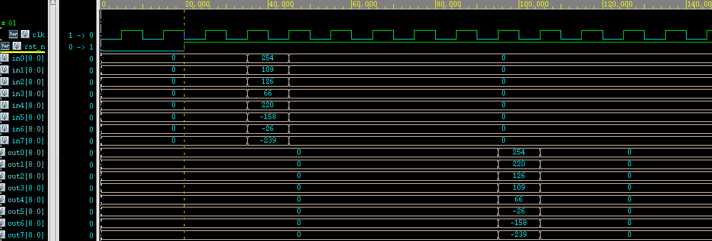

## How to Run Design Verification
```bash
cd verification
python gen_test_case.py
```

## ADFP
- Revision of `01_run` for system verilog
    - Original: `vcs -f file.f -full64 -R +v2k -debug_access+all +define+RTL +notimingcheck`
    - Updated: `vcs -f file.f -full64 -R -sverilog -debug_access+all +define+RTL +notimingcheck`
- Simulation result of Sort8 testbench

- To do
    - Generate input and golden at vectors directory
    - Build assertion comparing result and golden