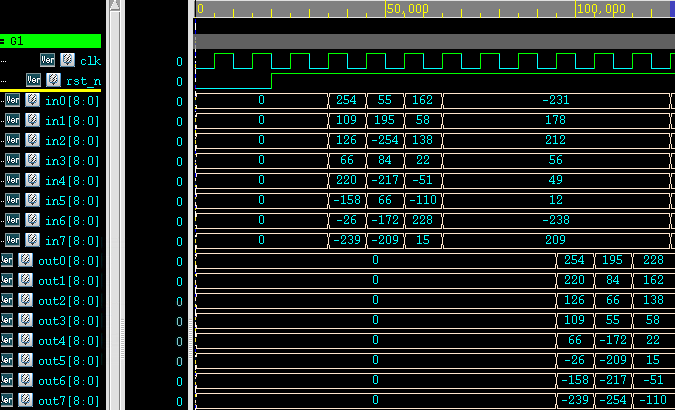
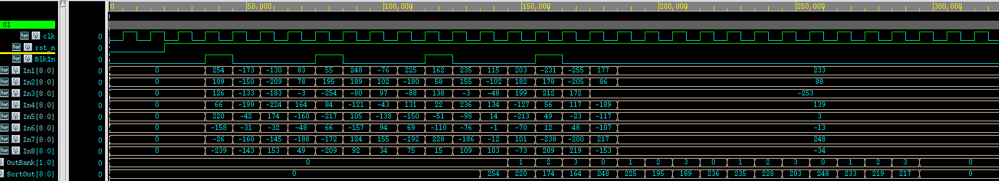
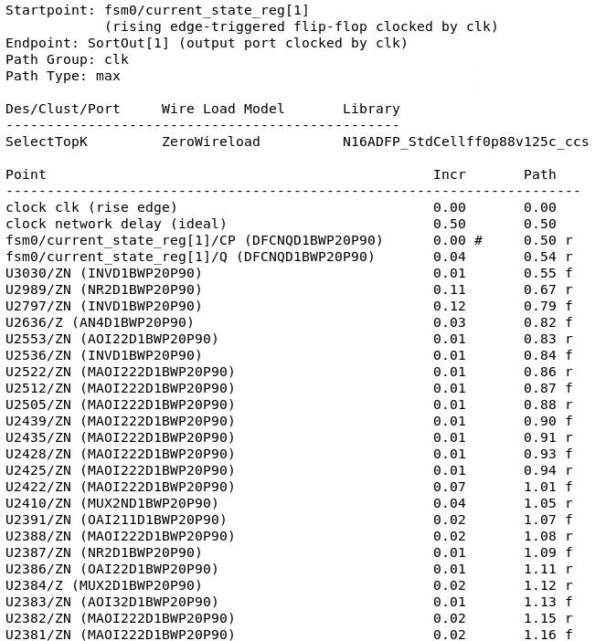
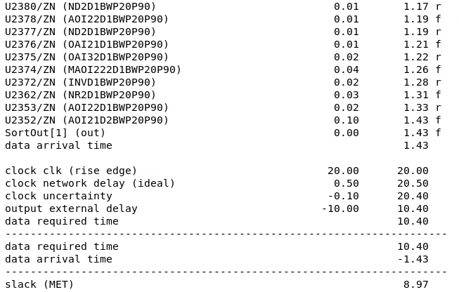
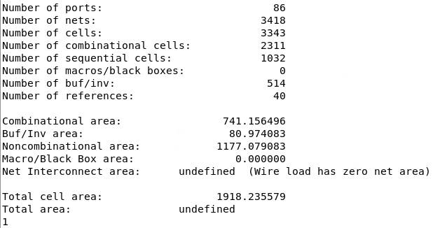

## To Do
 - Update report based on results of ADFP
 - Solve high fan-out problem
 - Try higher clock rate

## How to Run Design Verification
```bash
cd verification
python gen_test_case.py
```

## ADFP

### RTL Simulation

`01_run` must use `-sverilog` instead of `+v2k` for SystemVerilog files:
- Original: `vcs -f file.f -full64 -R +v2k -debug_access+all +define+RTL +notimingcheck`
- Updated:  `vcs -f file.f -full64 -R -sverilog -debug_access+all +define+RTL +notimingcheck`

Simulation results:




### Synthesis

Timing report:




Area report:

